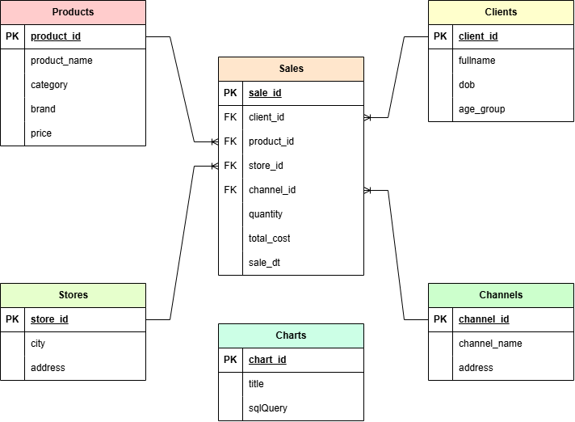

# 🚀 Shai.Pro Hackathon Project (Case 6) – AI-Powered BI Dashboard

An **AI-driven business intelligence dashboard** built for the **Shai.Pro Hackathon**.  
This web app allows users to query corporate databases in **natural language**, automatically converts queries into SQL, and visualizes the results with **real-time charts**.

---

## 🌟 Features

- **Natural Language Querying** – Ask questions like *“Average cost per product category”* and get instant insights.
- **Automatic SQL Generation** – Queries are translated into SQL using an open-source LLM and executed on a **Cloudflare D1** database.
- **Interactive Charts** – Results are displayed as live, dynamic charts using **Chart.js**.
- **Personal Dashboards** – Save queries and create custom dashboards. Export individual charts or the entire dashboard as images.
- **Real-Time Updates** – Powered by **WebSockets** for live chart refresh.

---

## 🛠 Tech Stack

| Layer        | Technology                                       |
|--------------|---------------------------------------------------|
| **Frontend** | Next.js (React), Chart.js, WebSockets             |
| **Backend**  | FastAPI (Python), WebSocket for live updates      |
| **Database** | Cloudflare D1                                     |
| **Auth**     | Firebase Authentication (with role-based access)  |
| **Deploy**   | Firebase Hosting + local FastAPI server           |

---

## 💻 Interface

### 🗨️ Chat Menu

The AI-powered chat interface enables users to:

1. **Enter a Natural Language Prompt** (e.g., *“Total sales by region this month”*).
2. **SQL Generation** – An open-source LLM (**Llama 4 Scout FP8**) creates an SQL query using a knowledge base embedded with `all-MiniLM-L6-v2`.
3. **Execution** – SQL is run on **Cloudflare D1** via the Dify marketplace tool (Cloudflare D1 Executor).
4. **Response & Visualization** – The system returns:
    - A natural-language explanation of the results.
    - The executed SQL query.
    - A **live Chart.js visualization**.

**Actions under the chart:**

- ➕ **Add to Dashboard** – Save SQL query to the database.
- 📥 **Download** – Export the chart as an image.

---

### 📊 Dashboard Menu

- View saved charts as blocks.
- ➕ **Add Block** – Save a new SQL query and visualization.
- 🔄 **Refresh** – Re-run SQL for all blocks to update data.
- 🌐 **Export** – Save the entire dashboard as a single image.

---

### 🔑 Knowledge Menu (Admin Only)

Accessible only to users with the `admin` role:

- **Instructions** – Guidelines for managing the knowledge base.
- **Embedded AI Chatbot** – Used to generate a `metadata.txt` file for Shai.Pro knowledge base integration.

---

## 🗂 Database Schema

The system requires the following Cloudflare D1 tables:



---

## ⚡ Running Locally

Clone the repository and start the development environment:

```bash
git clone https://github.com/sagyzdop/studio.git
cd zhurek-app
docker compose up -d
```

---

## 👥 Team

| Name                                                           | Role               | 
| -------------------------------------------------------------- | ------------------ | 
| [Bakhtiyar](https://sagyzdop.com)                              | Backend & Frontend |
| [Arlan](https://www.linkedin.com/in/arlan-mirseiit-1557a428a/) | AI Engineer        |
| [Bekzat](https://www.linkedin.com/in/bekzat-ashirbek/)         | AI Engineer        | 
| [Miras](https://www.linkedin.com/in/miras-menis-74360a328/)    | Data Engineer      | 

---

## 🔮 Next Steps

- Improve AI chatbot accuracy and SQL generation.
- Add chart customization (filters, chart types, etc.).
- Enhance dashboard export capabilities.

## ⚠️ Limitations & Hackathon Experience

During the hackathon, we worked on the hackathon.shai.pro platform.

While using this platform was not mandatory, we chose it to leverage bonus criteria and explore its workflow orchestration capabilities. However, several technical limitations prevented us from fully achieving our goals:
- ❌ Lack of support for certain tools (e.g., agent functionality for extended chatflow capabilities did not work as expected).
- ⚙️ Logic components like loops and iterations were unavailable, limiting model self-checking and workflow automation.
- 🧩 Occasional issues with the provided models affected all participants regardless of their chosen track.

Despite these challenges, the Shai.Pro support team was responsive and helpful, providing clear guidance and documentation. We believe that overcoming these issues would significantly improve the model’s accuracy and overall system performance.
